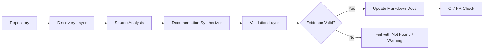
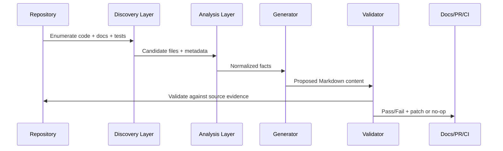
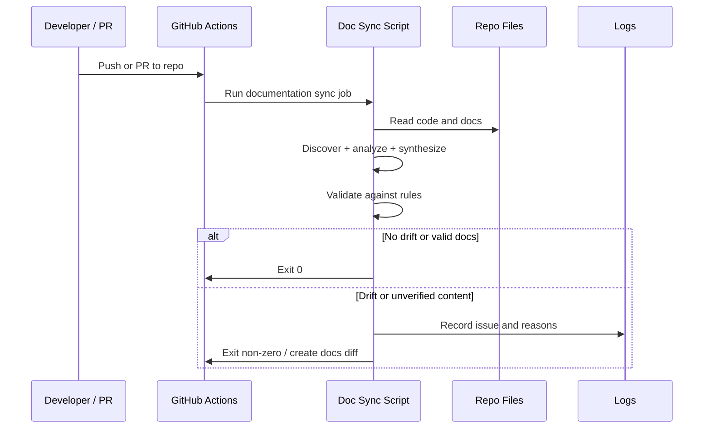

# Architecture

## Context

This repository is a small but real application composed of a Flask/SQLAlchemy backend and an Astro/Tailwind frontend. It also contains workshop documentation, test assets, and CI-oriented guidance. The documentation risk in this repository is not theoretical: the repository already emphasizes that generated documentation must reflect the actual code, tests, routes, scripts, and configuration, and that undocumented or unverified behavior must be recorded as `Not Found` rather than guessed.

The proposed architecture for Automated Documentation Sync addresses a specific gap: the repository has a healthy codebase and test structure, but no automated mechanism to keep the approved technical documentation synchronized with the evolving source of truth. In this project, the source of truth is the code, the test behavior, the route definitions, and the configuration that is actually checked into the repository.

This design is intentionally repository-native and conservative. It preserves the current architecture and minimizes new moving parts. It is designed to fit a Flask + SQLAlchemy + Astro + Tailwind application used in a workshop environment, not a large distributed platform. It is intentionally scoped to a defined subset of technical documentation and does not attempt to own or regenerate curated workshop learning content.

## Goals

- Discover only the approved documentation targets and source files required for technical docs.
- Analyze code, routes, models, pages, and tests to detect drift from the approved technical documentation subset.
- Generate or update Markdown documentation only when the output is directly supported by repo evidence.
- Preserve the rule that undocumented facts must be marked as `Not Found`.
- Validate documentation against the current source code, scripts, route contracts, and existing tests.
- Fail safely when evidence is missing or contradictory.
- Provide clear logging and actionable errors for local runs and CI execution.
- Keep the design suitable for this small repository and avoid unnecessary complexity.

## Existing System

The application already conforms to a straightforward layered structure:

- Backend: Flask app in `app/server/app.py`
- Data layer: SQLAlchemy models in `app/server/models/`
- Database setup and test seeding: utilities under `app/server/utils/`
- Frontend: Astro pages and components under `app/client/src/`
- E2E tests: Playwright tests under `app/client/e2e-tests/`
- Unit tests: Python `unittest` in `app/server/test_app.py`
- Project docs: root-level documentation, workshop content, and repo guidance

This structure is important because it gives the documentation sync system a clear contract:

- the backend exposes HTTP routes and JSON schemas;
- the frontend consumes those routes and renders page flows;
- the database and model layer define entities and constraints;
- tests provide the executable proof of expected behaviors;
- docs are written in Markdown and are intentionally not the single source of truth.

The repository also signals a design principle through `.github/copilot-instructions.md`: do not invent architecture or API behavior, and do not guess missing facts. This is a strong architectural constraint and should directly shape any documentation sync implementation.

## Proposed Architecture

The recommended architecture is a repository-native documentation sync pipeline implemented as a small Python CLI runner plus GitHub Actions validation. The system does not replace the web application. It observes the repository and updates only the approved technical documentation targets when the code changes.

The core idea is:

1. Discover only the approved technical documentation targets and source files.
2. Extract structured facts from code, routes, models, pages, and tests.
3. Compare those facts against the approved documentation sections.
4. Produce Markdown updates only when the facts are directly supported by repo evidence.
5. Validate output to ensure it is consistent, safe, and explicit about missing facts.
6. Exit with success or a precise failure condition based on evidence.

This is intentionally simpler than introducing a heavyweight documentation platform or a broad repo-wide generation system. The repository is not large enough to justify such complexity, and the project explicitly requires preserving the existing architecture and avoiding invented facts.

## Components

### 1. Repository Discovery Layer
Responsible for locating only the approved technical documentation targets and source files required for the sync workflow.

Examples of in-scope discovery:

- backend code (`app/server`)
- frontend code (`app/client/src`)
- test files (`app/server/test_app.py`, Playwright specs)
- approved repo docs and architecture targets
- CI files needed for validation

This layer should perform file selection using a manifest-driven approach rather than hard-coded assumptions. It prevents accidental scanning of unrelated directories and makes the system easier to test.

### 2. Source Analysis Layer
Responsible for extracting facts from code without making behavioral assumptions.

Examples:

- Python route definitions in Flask (`@app.route`)
- SQLAlchemy model metadata (tables, fields, enums)
- Astro page routes and data-fetch patterns
- environment variables used by the client/server
- test coverage and behaviors asserted by `unittest` and Playwright specs

This layer should normalize facts into a common internal model, such as:

- routes
- models
- pages
- tests
- configuration
- documentation targets

### 3. Validation and Policy Layer
Responsible for enforcing evidence-based documentation rules.

Validation includes:

- route existence checks
- field/schema checks
- cross-reference validation
- requirement matching against repo docs and tests
- detection of contradictory statements
- explicit `Not Found` handling when the repo does not define a behavior
- provenance checks for every generated section

### 4. Documentation Update Layer
Responsible for writing generated documentation to the approved technical documentation set. It should never rewrite application runtime code and should operate only on documentation files in the approved manifest.

### 5. Logging Layer
Responsible for structured logging, traceability, and reviewability.

This layer should capture:

- what files were scanned
- which facts were extracted
- which documentation sections were updated
- which sections were left as `Not Found`
- which validations failed and why
- which source file(s) or tests support each generated statement

## Component Responsibilities

| Component | Responsibility | Key output |
| --- | --- | --- |
| Discovery | Identify allowed repo boundaries and approved document targets | File inventory |
| Source analysis | Parse routes, models, UI pages, tests, and config | Normalized facts |
| Validation and policy | Enforce `Not Found`, provenance, and evidence rules | Validation result |
| Documentation update | Write approved docs only when supported by evidence | Revised Markdown |
| Logging | Emit traceable logs for local runs and CI | Execution log |

## Data Flow

The data flow is intentionally one-way and evidence-based. The system does not infer undocumented behavior from general project assumptions.

Core data objects include:

- RepositoryManifest
- RouteFact
- ModelFact
- PageFact
- TestFact
- ConfigFact
- DocSection
- ValidationResult

The documentation system should treat these as plain data structures rather than ad hoc strings. That makes it easier to compare new facts against previous docs and to detect drift.

## Sequence Flow

The sequence is deliberately explicit: documentation work is not a side-effect of the app runtime. It runs as a controlled, testable workflow independent of the application’s business logic.

## Technology Choices

### Selected Approach: Python-based repository sync pipeline with GitHub Actions

This is the best fit for this repository because:

- Python is already used for backend testing and the repository is grounded in a Python-first environment.
- A Python CLI script can use `ast`, `inspect`, and simple file parsing without adding a heavy framework.
- The repo already depends on Flask, SQLAlchemy, and Playwright, so a Python orchestrator fits the existing toolchain naturally.
- GitHub Actions is already a central theme in the project’s workshop content and is the natural CI system for this repo.
- Markdown is the native documentation format used in the repository and the project already emphasizes documentation quality.

### Recommended minimal stack

- Python 3.x
- stdlib modules for file walking, JSON, logging, subprocess, and parsing
- optional `sqlalchemy` introspection for data model extraction
- GitHub Actions workflow for PR validation
- Markdown templates and doc diffs generated into the repo

### Scope constraint

The system is intentionally limited to the repository’s approved technical documentation set. It is not designed to rewrite workshop narrative content, educational materials, or other curated documentation that is not directly derived from code and tests.

This is a deliberate fit for the repository, because not every doc in the project is a technical fact derived from runtime behavior. The repo already separates workshop content from implementation details, and the sync system should respect that distinction.

## Error Handling

The documentation sync system should be fail-closed rather than optimistic.

### Error categories

- Missing source file: record warning, continue if optional; fail if required
- Parse error: log exact file and issue, continue with degraded output
- Route or schema mismatch: fail validation for that section
- Missing evidence: emit `Not Found` and continue
- Contradictory evidence: fail the run and require a human review
- Documentation write failure: fail without leaving partial output
- Missing provenance for a generated statement: fail validation for that section

### Principles

- Never guess missing behavior.
- Never silently overwrite a section with unsupported assertions.
- Preserve existing content that is still valid.
- Log the exact reason a doc diff was rejected.
- Keep the output deterministic for CI and local reproducibility.
- Use atomic writes so a failed run never leaves half-written documentation.

### Example behavior

If the system cannot confirm a route parameter or a response field, it should write a section such as:

- `Status: Not Found`
- `Notes: No evidence found in the repository for this behavior.`
- `Evidence: Not Found`

This aligns with the repository’s documentation guidelines and keeps the system honest.

## Security

The automation should operate under strict read-only repository analysis and minimal write access.

Security controls:

- Run in a repository-controlled workflow with least-privilege permissions.
- Restrict all write operations to the approved documentation subset only.
- Never expose credentials or secrets in generated documentation.
- Do not log environment variables, API keys, tokens, or connection strings.
- Validate generated markdown before commit or PR creation.
- Treat user-provided content or external data as untrusted until validated.
- Require explicit provenance for every generated statement.

The repository’s security rules explicitly prohibit exposing secrets and sensitive values. The documentation sync process must inherit that rule. This is especially important because documentation generation is a repo-writing workflow; logs, prompts, and generated markdown must remain non-sensitive and should never include workspace secrets.

## Testing Strategy

The architecture should prioritize testability from the start.

### Unit tests

- route extraction parser
- model extraction and schema normalization
- documentation template rendering
- `Not Found` decision logic
- validator contradictions and missing-data handling

### Contract tests

- compare generated docs against real route definitions found in Flask
- verify generated docs match SQLAlchemy model field names
- ensure Astro pages and components are reflected in page inventory
- confirm test coverage references are consistent with repository files

### Snapshot tests

- generate documentation from a known repo state and compare to a golden markdown snapshot
- block changes when output is unexpectedly large or unstable

### CI tests

- run the documentation sync script in dry-run mode
- fail if docs drift from the code
- fail if an unverified fact is generated without a `Not Found` label

This architecture is fully compatible with the repository’s existing Python `unittest` model and Playwright-based end-to-end validation pattern. It does not require a new test framework or a rewrite of the app.

## Deployment/CI Considerations

The recommended execution model is GitHub Actions, because that aligns with the project’s workshop and CI-centric documentation.

### Recommended CI flows

1. Pull request validation
   - run the documentation sync script in validation mode
   - fail on drift or invalid documentation
   - produce a diff summary for review

2. Default branch validation
   - run the same checks on the default branch to ensure generated docs remain aligned with source code

3. Local developer runs
   - support validation and dry-run generation to confirm correctness before a write is attempted

### Scope boundaries

- The system should only write to the approved documentation subset, not source code.
- It should not run application migrations or modify database state.
- It should be safe to run in both local development and CI.
- It should avoid modifying curated workshop content unless explicitly approved.

### Execution model

Use a single Python CLI entry point with clear modes:

- `analyze` - scan repository and emit structured facts
- `validate` - check documentation against source evidence
- `generate` - produce draft documentation for approved technical sections
- `sync` - analyze + generate + validate, then update the approved documentation subset if needed

This keeps the system understandable and testable while aligning with the repo’s existing Python and GitHub Actions conventions.

## Architecture Decisions

1. Repository-native sync rather than platform-level automation.
   - The repo is a codebase with docs in the same repo, so the pipeline should live with the code.

2. Evidence-first documentation.
   - All generated statements must be traceable to source code or tests.

3. `Not Found` is a first-class output.
   - Ambiguous or missing facts are not ignored.

4. Documentation is write-protected and side-effect limited.
   - The system updates only approved technical docs and never modifies runtime application behavior.

5. GitHub Actions is the CI executor.
   - It fits the repo’s documented GitHub-centric workflows and keeps validation simple.

6. Keep the implementation lean.
   - No heavy orchestration framework or distributed system is justified for this repo.

7. Provenance is required for generated content.
   - Every generated statement must have a clear evidence trail or a clear `Not Found` explanation.

8. Atomic writes are required.
   - Failed runs must not leave partial documentation updates behind.

## Out of Scope

This architecture intentionally does not include:

- application feature development
- backend business logic changes
- database schema migrations
- frontend UI feature changes
- deployment to Azure or other hosting providers beyond CI validation
- deep AI prompt orchestration or external SaaS subscriptions
- broad enterprise documentation standards outside this repository’s actual constraints

The system’s purpose is a narrow but valuable one: maintain accurate repository documentation using the code and tests as the source of truth, while documenting uncertainty as `Not Found` instead of inventing facts.
