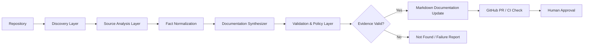
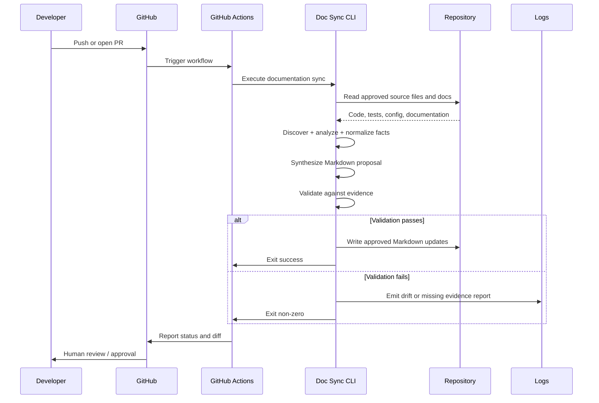

# Automated Documentation Sync Architecture

## 1. Purpose

This architecture defines a repository-native documentation synchronization system for the pets-workshop project. The system exists to keep approved technical documentation aligned with the project’s executable sources of truth: the Flask backend, SQLAlchemy models, Astro UI pages, tests, and repository configuration.

The architecture is intentionally conservative and evidence-based. It does not infer undocumented behavior. When facts are missing, the system records `Not Found` instead of guessing.

## 2. Scope

The system is scoped to the repository’s approved documentation lifecycle and must not modify application runtime code. It is designed for the current project structure:

- Backend: `app/server/app.py`
- Data layer: `app/server/models/`
- Database and utilities: `app/server/utils/`
- Frontend: `app/client/src/`
- Automated tests: `app/server/test_app.py` and Playwright specs under `app/client/e2e-tests/`
- Approved documentation targets: root-level docs, architecture files, and repository technical documentation assets

## 3. Requirements Alignment

The architecture is derived from the repository evidence and the requirements in `requirements.md`:

- The project uses Flask + SQLAlchemy and Astro + Tailwind.
- The system must preserve the existing architecture and avoid inventing facts.
- The documentation sync process must validate generated output against source evidence.
- Missing business or technical detail must be explicitly marked as `Not Found`.
- Output must be limited to approved Markdown documentation only.

## 4. Architectural Principles

1. Evidence over inference
   - Documentation is generated only from repository facts.
2. Read-only repository analysis
   - The sync system reads source files, tests, routes, and docs; it does not alter application behavior.
3. Explicit unknown handling
   - Missing facts are captured as `Not Found` rather than assumed.
4. Minimal integration footprint
   - No new runtime service is introduced into the application stack.
5. CI-friendly execution
   - The pipeline is designed to run locally and in GitHub Actions.
6. Human approval for doc changes
   - Documentation updates are reviewable and must be approved before merge.

## 5. High-Level Architecture

## 6. Components and Responsibilities

### 6.1 Repository Discovery Layer
Responsible for identifying the exact set of files and directories that are in scope for documentation analysis.

In scope for this repository:
- `app/server/`
- `app/client/src/`
- `app/server/test_app.py`
- Playwright specs in `app/client/e2e-tests/`
- approved documentation targets
- project configuration files relevant to validation

Responsibilities:
- enumerate repo files
- filter to approved documentation sources only
- maintain a manifest of allowed inputs and outputs
- prevent unrelated directories from being scanned

### 6.2 Source Analysis Layer
Extracts facts from the app and repository without making assumptions.

Examples of evidence to read:
- Flask route definitions in `app/server/app.py`
- SQLAlchemy model declarations
- Astro page layouts and data-fetching patterns in `app/client/src/pages/`
- unit tests in `app/server/test_app.py`
- Playwright behavior and route expectations in `app/client/e2e-tests/`

Responsibilities:
- parse route definitions and HTTP contracts
- inspect model metadata and schema references
- analyze page structure and client/server dependencies
- read tests and validation scripts for behavior evidence
- convert raw file findings into normalized facts

### 6.3 Fact Normalization Layer
Creates a consistent internal representation of repository facts.

Suggested normalized fact types:
- RouteFact
- ModelFact
- PageFact
- TestFact
- ConfigFact
- DocumentTarget
- ValidationResult

Responsibilities:
- remove duplication and ambiguity between source files
- map multiple representations into a common schema
- preserve provenance for every generated statement
- record “Not Found” for missing facts or undocumented behavior

### 6.4 Documentation Synthesizer
Builds Markdown content only from normalized facts and approved documentation targets.

Responsibilities:
- compare current facts against target documentation sections
- generate new or updated Markdown content only when evidence exists
- leave unsupported or missing details as `Not Found`
- avoid rewriting runtime app code
- maintain stable output formatting for repository docs

### 6.5 Validation and Policy Layer
Enforces repository rules and evidence quality gates.

Validation rules:
- generated content must trace back to source evidence
- missing information must be labeled `Not Found`
- output must not claim behavior that is not present in code or tests
- only approved documentation files may be updated
- contradictory facts must be flagged as drift or failure

Responsibilities:
- check final Markdown against source evidence
- fail closed on missing verification
- produce actionable validation output for CI and review

### 6.6 Documentation Update Layer
Applies approved Markdown updates to the repository.

Responsibilities:
- write documentation only in allowed files
- maintain a patch or diff for review
- avoid direct changes to application source files
- support dry-run mode for local validation

### 6.7 Logging and Traceability Layer
Creates auditability for operations and review.

Responsibilities:
- record files examined
- record source evidence used for each generated statement
- record validation failures and `Not Found` decisions
- expose logs to CI and local developer runs

### 6.8 GitHub Actions Trigger Layer
Executes the documentation sync workflow in CI.

Responsibilities:
- run on pull requests and selected branch activity
- report pass/fail status to GitHub checks
- surface generated diff for review
- block merge when validation fails

## 7. Trigger Model

The recommended trigger model is repository-driven and intentionally lightweight.

Primary triggers:
- pull request opened or updated
- push to the default branch
- manual workflow dispatch for controlled runs

Optional secondary triggers:
- nightly scheduled validation to catch drift outside normal PR flow
- targeted reruns when documentation manifest files change

The trigger model should not run as part of the application runtime or as an app server side effect. It should remain an explicit repository workflow.

## 8. Data Flow

The flow preserves a strict pattern:
- repository facts are read
- normalized facts are generated
- docs are updated only when justified by evidence
- results are validated before acceptance

## 9. Security Controls

Because the system works on repository content, the security model should be minimal but explicit.

### 9.1 Read-only access to source content
- The sync process should read repository files only.
- It should not execute application runtime code beyond minimal validation commands.

### 9.2 Scope control
- Allowed input directories must be enumerated by a manifest.
- Unapproved directories must never be scanned.

### 9.3 No secret exposure
- The pipeline must not print tokens, passwords, or connection strings.
- Any repository or system secrets used by CI should be managed by GitHub secrets and not embedded in docs.

### 9.4 Branch and review protection
- Documentation updates should flow through standard pull requests.
- Required checks should validate that generated content is compliant.

### 9.5 Output safety
- Only Markdown files in approved documentation targets may be written.
- File writes outside the documentation set must be blocked.

### 9.6 Failure-safe behavior
- If evidence is incomplete or contradictory, the workflow must fail rather than produce guessed content.

## 10. Approval Workflow

The approval workflow should reflect the repository’s engineering practices and avoid uncontrolled doc changes.

Recommended approval model:

1. Developer creates or updates a branch with code or doc-related changes.
2. CI runs documentation sync.
3. The sync script compares repository facts to approved docs and produces either:
   - no change, or
   - a Markdown diff, or
   - a validation failure
4. If content changes are generated, they appear in a PR as a reviewable doc patch.
5. Reviewer validates that the patch matches repo evidence and the `Not Found` policy.
6. Merge is allowed only when:
   - required checks pass
   - documentation changes are reviewed
   - no unsupported claims are present

This keeps the system human-verifiable while still automating repetitive documentation drift checks.

## 11. Operational Characteristics

### Local execution
The documentation sync process should be executable from a developer environment using Python and the repository’s existing tooling conventions.

### CI execution
GitHub Actions should run the same validation and update logic as local execution to keep behavior consistent.

### Idempotence
Repeated runs against the same repository state should produce the same output and no additional drift.

### Observability
The workflow should emit logs covering discovery scope, extracted facts, validation results, and any `Not Found` decisions.

## 12. Known Constraints

- The repository is a small workshop app, not a large enterprise platform.
- The project has explicit guidance not to invent missing facts.
- The existing app architecture is Flask + SQLAlchemy backend and Astro + Tailwind frontend.
- No Confluence business overview was present in the available repository context.
- Detailed operational requirements such as uptime targets, accessibility goals, or advanced security controls are not yet defined in the available evidence.

## 13. Architecture Decision Summary

The selected design is a Python-based documentation sync pipeline running through GitHub Actions, with evidence-based validation and human review. This is the best fit for the repository because it preserves the architecture, uses the project’s existing Python-first tooling, minimizes new moving parts, and enforces the project’s explicit requirement to use `Not Found` when facts are missing.

This architecture satisfies the current repo reality while remaining intentionally narrow: it synchronizes approved technical documentation without changing the application’s functional behavior or creating undocumented product claims.
